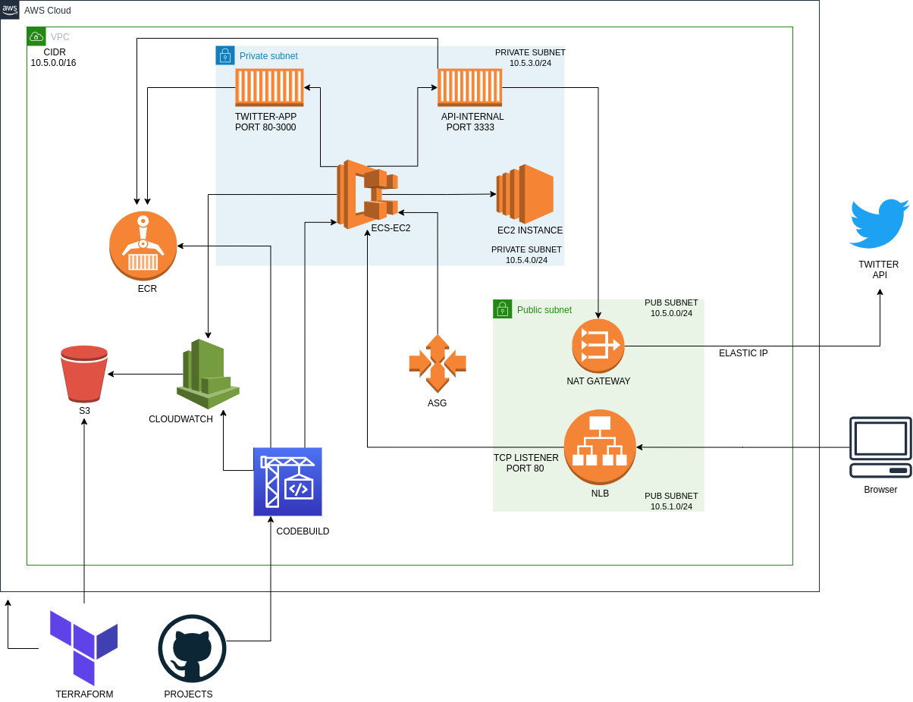

# Twitter app

Construção de ambiente utilizando pipeline de entrega para coleta de tweets com as tags informadas pelo user.

## Arquitetura.

Para escrever a automação, utilizei dois repositórios privados no github.  
Sendo eles: [Aplicação](https://github.com/felipteixeira/twitter-app) e
[Terraform](https://github.com/felipteixeira/terraform-twitter-project)

* Redes:
    Foi criado uma VPC com o CIDR 10.5.0.0/16 e 4 subnets utilizando 2 availabity zones.
    public_subnets_cidr: ["10.5.0.0/24", "10.5.1.0/24"] subnets com rotas para IGW.
    private_subnets_cidr: ["10.5.3.0/24", "10.5.4.0/24"] para utilização a recursos internos.

* Security Group:
    Porta 8080 liberada para o bloco [0.0.0.0/0].
    Todos os protocolos liberados paras as redes: ["10.5.0.0/16"].

